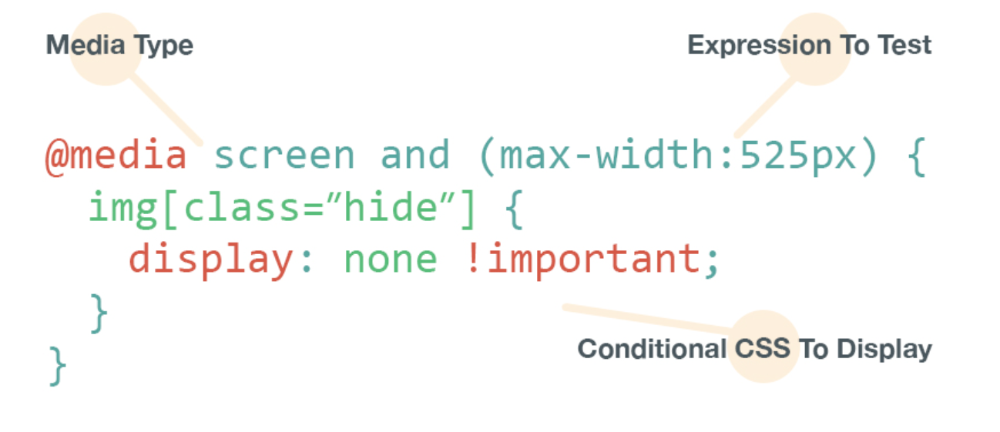
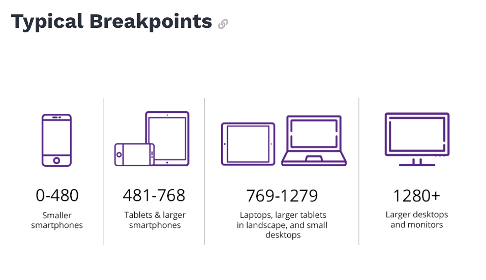
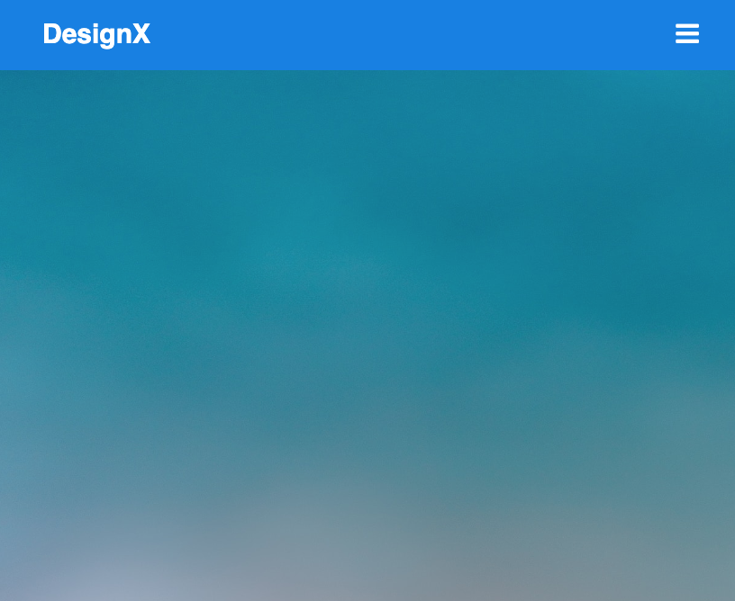
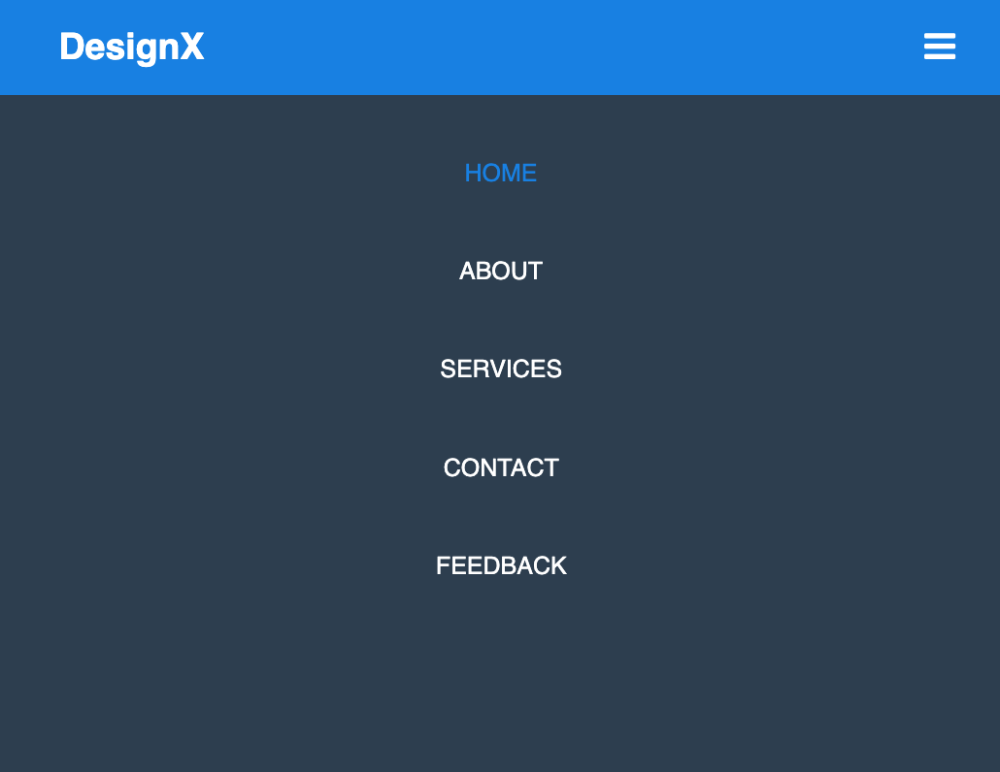

# Responsive navigation bar (Part 2 - with media queries)

In this follow-me exercise you will learn how to create a responsive navigation bar with HTML and CSS.

## Installation

Download/clone this repo to your machine (Mac / Win).
Next open the **style.css** file from the repository that you downloaded above with your editor Visual Studio Code.  

## Media Queries in CSS

The media queries are a special syntax for CSS that allows us to define some styles that will only be applied in the case that defined conditions are met. We can assimilate them to optional lines of code, which will only be displayed for some users or devices

### Syntax for Media Queries




### Example

For example, we want to show a specific code only on screens and with a resolution less than **400px**. The resulting code would be:

```css
@media screen and (max-width: 400px) { … }
```


In the below code, we have specified that when the minimum screen width is 600px or wider then the font-size of the paragraph will change to 16px. So any device with this screen width will display the paragraph text in the specified font size.

```css
@media screen and (min-width: 600px) {

p {

font-size: 16px;

}

}
```

Typical break points when working with Media Queries





## Final Result





